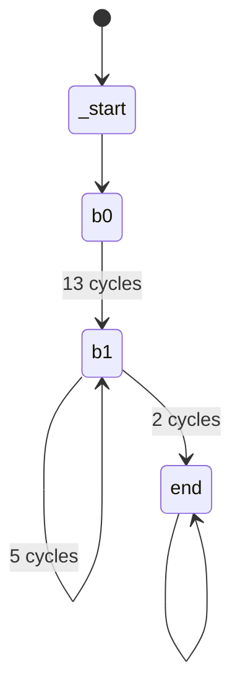

# Tutorial: Creating time annotations

This tutorial provides a step by step guide about how to write QTA timing annotations for binary programs. The examples in this tutorial are targeted at RISC-V, but the general process is independent of the target architecture.

Let us start with a very minimalistic example.

## Tutorial 1: A minimal program

The following listing shows the disassembly of the a minimalistic RISC-V program in [/extra/tutorial/program01.elf](/extra/tutorial/program01.elf), which consists only of the two basic blocks `_start` at 0x8000000 and `end` at 0x8000000C.

```
program01.elf:     file format elf32-littleriscv


Disassembly of section .init:

80000000 <_start>:
80000000:	00200093          	li	ra,2
80000004:	00300113          	li	sp,3
80000008:	002081b3          	add	gp,ra,sp

8000000c <end>:
8000000c:	0000006f          	j	8000000c <end>
```

### The Control Flow Graph

Let us assume that we want to annotate the execution time of block `_start` with 42 clock cycles. For this we have to specify a CFG (Control Flow Graph) with both basic blocks `_start`and `end` and annotate the edge between both with the value 42. Thus, the time-annotated CFG should look like this:


### The QTA Timing Database

The blocks of the CFG are defined with `<Block ... />` tags. They must have unique `id` and `address` attributes.

```xml
<Block address="0x80000000" blocktype="start" id="_start" />
<Block address="0x80000000" id="b0"/>
<Block address="0x8000000c" id="_end"/>
```

Edges of the CFG are defined with `<Edge ... />` tags and range from the block referenced by `source` to the block referenced by `target`.

```xml
<Edge cycles="0" source="_start" source_context="" target="b0" target_context=""/>
<Edge cycles="42" source="b0" source_context="" target="_end" target_context=""/>
```

> **Note:**
> The `context` attributes allow to specify CFG edge timing for different _execution contexts_. This can become useful for specifying
>
>   - loop iterations and/or recursive functions calls
>   - function calls that occur in different call stacks
>
> The first two tutorials do not specify context-dependent timing. Thus we leave the `source_context`and `target_context` attributes empty. We will come back to contexts in the third tutorial program, where we will show how to import time-annotated CFGs from the WCET (Worst Case Execution Time) analysis tool aiT from AbsInt GmbH.

Finally, we have to specify at which block and in which execution context the time simulation should be started. This is done with the two attributes `startBlock` and `startContext` of the root element `qta:TimingAnnotation`. In this example, we set the start block to `_start` and, since we do not use contexts in this example, we set the start context to the empty string.

The following listing shows the complete QTA timing database (.qtdb):

```xml
<?xml version="1.0" encoding="UTF-8"?>
<qta:TimingAnnotation
    xmlns:xsi="http://www.w3.org/2001/XMLSchema-instance"
    xsi:schemaLocation="https://www.hni.uni-paderborn.de/sct qta.xsd"
    xmlns:qta="https://www.hni.uni-paderborn.de/sct"
    startBlock="_start"
    startContext="">
   <Blocks>
     <Block address="0x80000000" blocktype="start" id="_start" />
     <Block address="0x80000000" id="b0"/>
     <Block address="0x8000000c" id="_end"/>
   </Blocks>
   <Edges>
     <Edge cycles="0" source="_start" source_context="" target="b0" target_context=""/>
     <Edge cycles="42" source="b0" source_context="" target="_end" target_context=""/>
   </Edges>
</qta:TimingAnnotation>
```

### Run the time simulation

From inside the folder tutorial, this example can be simulated with the following command:

```bash
../qemu/bin/qemu-system-riscv32 -M virt -bios none -kernel program01.elf -plugin ../libqta.so,arg=./program01.qtdb
```

## Tutorial 2: A simple loop

The second tutorial is based on the program [/extra/tutorial/program02.elf](/extra/tutorial/program02.elf), which contains a loop that is executed 5 times in a row.

The following listing shows the corresponding disassembly:

```
program02.elf:     file format elf32-littleriscv


Disassembly of section .init:

80000000 <_start>:
80000000:	00200293          	li	t0,5

80000004 <loop>:
80000004:	fff28293          	addi	t0,t0,-1
80000008:	fe029ee3          	bnez	t0,80000004 <loop>

8000000c <end>:
8000000c:	0000006f          	j	8000000c <end>
```

### The Control Flow Graph

In this example, the execution of `b0` block takes 13 cycles. It includes the first loop iteration. The remaing 4 loop iterations, which are represented by block `b1`, take 5 cycles each. The program flow from `b1` to `end` shall need additional 2 cycles, resulting in a total of 13 + (4*5) + 2 = 35 cycles. Thus, the time-annotated CFG should look like this:



### The QTA Timing Database

The following blocks have been defined:

```xml
<Block address="0x80000000" blocktype="start" id="_start"/>
<Block address="0x80000000" last_instruction="0x80000008" id="b0"/>
<Block address="0x80000004" last_instruction="0x80000008" id="b1"/>
<Block address="0x8000000c" blocktype="end" id="end"/>
```

In contrast to the first tutorial, this example now introduces branches. Here, the block `loop` is executed exactly 5 times before the loop exit condition is true.

```xml
<Edge cycles="0" source="_start" source_context="" target="b0" target_context=""/>
<Edge cycles="13" source="b0" source_context="" target="b1" target_context=""/>
<Edge cycles="5" source="b1" source_context="" target="b1" target_context=""/>
<Edge cycles="2" source="b1" source_context="" target="end" target_context=""/>
```

Like in the first tutorial, the start block is set to `_start` and all contexts are the empty string.

The following listing shows the complete QTA timing database (.qtdb):

```xml
<?xml version="1.0" encoding="UTF-8"?>
<qta:TimingAnnotation
    xmlns:xsi="http://www.w3.org/2001/XMLSchema-instance"
    xsi:schemaLocation="https://www.hni.uni-paderborn.de/sct qta.xsd"
    xmlns:qta="https://www.hni.uni-paderborn.de/sct"
    startBlock="_start"
    startContext="">
  <Blocks>
    <Block address="0x80000000" blocktype="start" id="_start"/>
    <Block address="0x80000000" last_instruction="0x80000008" id="b0"/>
    <Block address="0x80000004" last_instruction="0x80000008" id="b1"/>
    <Block address="0x8000000c" blocktype="end" id="end"/>
  </Blocks>
  <Edges>
    <Edge cycles="0" source="_start" source_context="" target="b0" target_context=""/>
    <Edge cycles="13" source="b0" source_context="" target="b1" target_context=""/>
    <Edge cycles="5" source="b1" source_context="" target="b1" target_context=""/>
    <Edge cycles="2" source="b1" source_context="" target="end" target_context=""/>
  </Edges>
</qta:TimingAnnotation>
```

### Run the time simulation

From inside the folder tutorial, this example can be simulated with the following command:

```bash
../qemu/bin/qemu-system-riscv32 -M virt -bios none -kernel program02.elf -plugin ../libqta.so,arg=./program02.qtdb
```

## Tutorial 3: Import WCET time behavior from AbsInt aiT

We have provided the tool `ait2qta` that automatically generates a QTA Timing Database from a timing analyis report from the WCET timing analysis tool aiT from AnsInt GmbH. It always takes the analysis with the `-i` option.
The `-o` option tells ait2qta where to put the new QTA timing database file. The third option `-g` will not write the timing database but plot the extracted aiT control flow graph instead.

### Generate the QTDB from an aiT report file

The third tutorial program was intended to demonstrate ait2qta. Head over to that folder and run
```bash
../util/ait2qta -i program03.a3report -o program03.qtdb
../util/ait2qta -i program03.a3report -g program03.pdf
```

### Run the time simulation

From inside the folder tutorial, this example can be simulated with the following command:

```bash
../qemu/bin/qemu-system-arm -M netduino2 -nographic -kernel program03.elf -plugin ../libqta.so,arg=./program03.qtdb
```

# Additional information

For more information, please refer to the XSD schema file [qta.xsd](/extra/xsd/qta.xsd) that describes the QTA TimingDatabase format in full detail.
